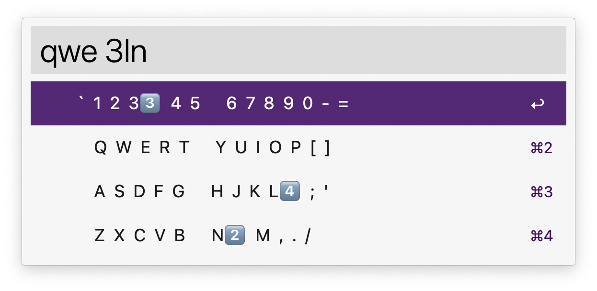

# alfred-keyknight 
conquer your keyboard 👇️

An Alfred Worfklow to review the layout of your keyboard and corresponding finger positions.

<a href="https://github.com/giovannicoppola/alfred-keyknight/releases/latest/">
 
</a>

<!-- MarkdownTOC autolink="true" bracket="round" depth="3" autoanchor="true" -->

- [Motivation](#motivation)
- [Setting up](#setting-up)
- [Basic Usage](#usage)
- [Known Issues](#known-issues)
- [Acknowledgments](#acknowledgments)
- [Changelog](#changelog)
- [Feedback](#feedback)

<!-- /MarkdownTOC -->

<h1 id="motivation">Motivation ✅</h1>

- Quickly check the layout and finger positions of QWERTY and Dvorak keyboard to improve your touchtyping or learn a new keyboard layout.

<h1 id="setting-up">Setting up ⚙️</h1>

- Alfred 5 with Powerpack license
- Python3 (howto [here](https://www.freecodecamp.org/news/python-version-on-mac-update/))

## Default settings 
- In Alfred, open the 'Configure Workflow' menu in `alfred-keyknight` preferences
	- set the keyword or hotkey to open in map mode (all keys labeled, default: `qwe`)
	- set the keyword or hotkey to open in learning mode (no keys labeled, default: `qww`)
	- set keyboard layout (`QWERTY` and `Dvorak` currently supported)
	- choose the set of symbols to indicate finger positions (default: 1️⃣2️⃣3️⃣)
	- set overall spacing
	- set left padding
	

<h1 id="usage">Basic Usage 📖</h1>

- open in map or learning mode, then press keys to see their position on the keyboard and corresponding finger
- QuickLook (⌘-Y or ⇧) will show a diagram of the keyboard layout.

<h1 id="known-issues">Limitations & known issues ⚠️</h1>

- May not show spacing correctly in some Alfred themes

<h1 id="acknowledgments">Acknowledgments 😀</h1>

- Thanks to the [Alfred forum](https://www.alfredforum.com) community!
- Patrick Sy ([@zeitlings](https://github.com/zeitlings) for ispiration with [Calendar++](https://github.com/zeitlings/alfred-calendar))
- Icon from [Flaticon](https://www.flaticon.com/free-icon/wasd_8982293)
- keyboard diagrams from https://onlinetyping.org/

<h1 id="changelog">Changelog 🧰</h1>

- 10-11-2024: version 0.1

<h1 id="feedback">Feedback 🧐</h1>

Feedback welcome! If you notice a bug, or have ideas for new features, please feel free to get in touch either here, or on the [Alfred](https://www.alfredforum.com) forum. 
